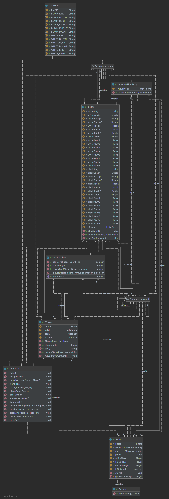
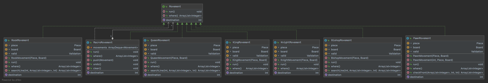
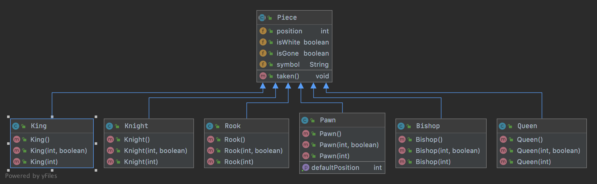

Group3 Mini Project
===

Member
---

- Taka(Takayuki)
- Miriam
- Yasu(Takayasu)

System Design
---

**Player => Input => Piece => Movement => Board => Console**

Class / Interface
---

### Piece: abstract class

### King / Queen ... extend Piece

- boolean isWhite
- int value
- boolean isDead
- Position position

### Movement: Interface
- run()

### MacroMovement implement Movement
- controls the history of players' movement.

- ArrayList<Movement> events
- run();
- push();
- undo();
- clear();

#### KingMovement / QueenMovement ... Implement Movement
- Board board
- Position
- run();
- movable()

### Board
- controls the position(location 0...88) of each piece.
- notify()

### Player
- executes the movement of each piece.
- controls how many pieces each player has.

### Game
- controls the player's turn (which player is playing now)

### Input
- controls players' input

### Validation

### Console

### Symbol

### Driver

### UML diagram
- chess pagackage

- command pagackage

- pieces pagackage

